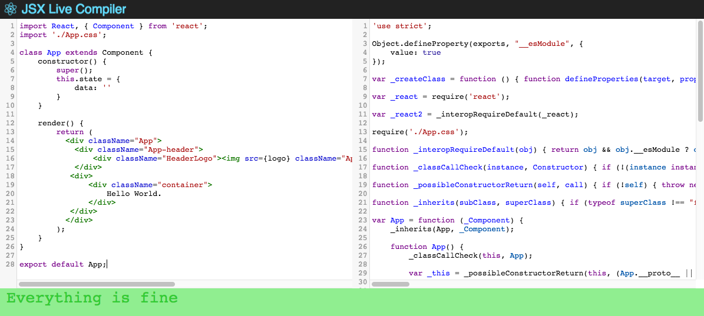

# jsx-live-compiler

Compile your JSX to Javascript live in your browser!

jsx-live-compiler is a react app that will compile your jsx live in your browser to the javascript equivalent.

## Commands

### `npm start`

Runs the app in the development mode. 
Open [http://localhost:3000](http://localhost:3000) to view it in the browser.

The page will reload if you make edits. 
You will also see any lint errors in the console.

### `npm run build`

Builds the app for production to the `build` folder. 
It correctly bundles React in production mode and optimizes the build for the best performance.

The build is minified and the filenames include the hashes. 
Your app is ready to be deployed!

For the project to build, **these files must exist with exact filenames**:

* `public/index.html` is the page template;
* `src/index.js` is the JavaScript entry point.

You can delete or rename the other files.

